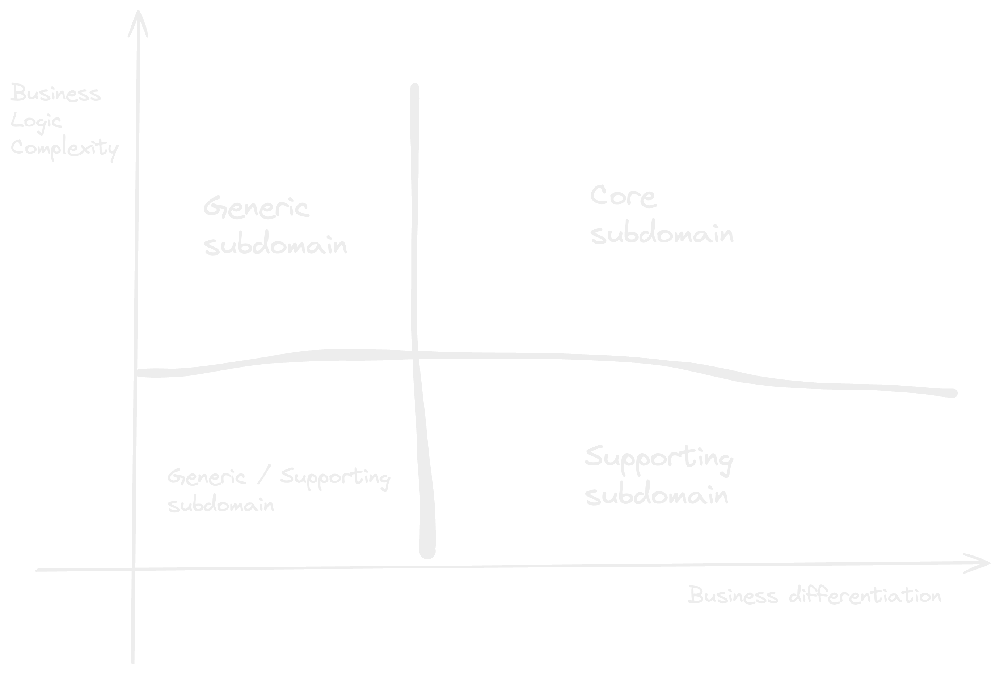

## Business domain
A business domain defines a company’s main area of activity. Generally speaking, it’s the service the company provides to its clients. For example:
- Santander is a bank.
- Starbucks is best known for its coffee.

Boundaries of the functionalities of the business.

## Business subdomains
A subdomain is a fine-grained area of business activity. All of a company’s subdomains form its business domain.

For example, Starbucks may be most recognized for its coffee, but building a successful coffeehouse chain requires more than just knowing how to make great coffee. You also have to buy or rent real estate at effective locations, hire personnel, and manage finances, among other activities. None of these subdomains on its own will make a profitable company. All of them together are necessary for a company to be able to compete in its business domain(s).

## Types of Subdomains
Just as a software system comprises various architectural components—databases, frontend applications, backend services, and others—subdomains bear different strategic/business values. Domain-driven design distinguishes between three types of subdomains: core, generic, and supporting. Let’s see how they differ from a company strategy point of view.

### Core subdomain
A core subdomain is what a company does differently from its competitors. This may involve inventing new products or services or reducing costs by optimizing existing processes.

To maintain a competitive advantage, core subdomains involve inventions, smart optimizations, business know-how, or other intellectual property.

- Provides competitive advantage to the business.

For example, Google’s advertising platform accounts for the majority of its profits. Its ability to provide excellent search results is what drives traffic, and subsequently, it is an important component of the Ads platform. So, for Google, the ranking algorithm is a core subdomain.

### Generic subdomain
Generic subdomains are business activities that all companies are performing in the same way.

For example, most systems need to authenticate and authorize their users.

### Support subdomain
As the name suggests, supporting subdomains support the company’s business. However, contrary to core subdomains, supporting subdomains do not provide any competitive advantage.

## Subdomains as a set of coherent use cases

